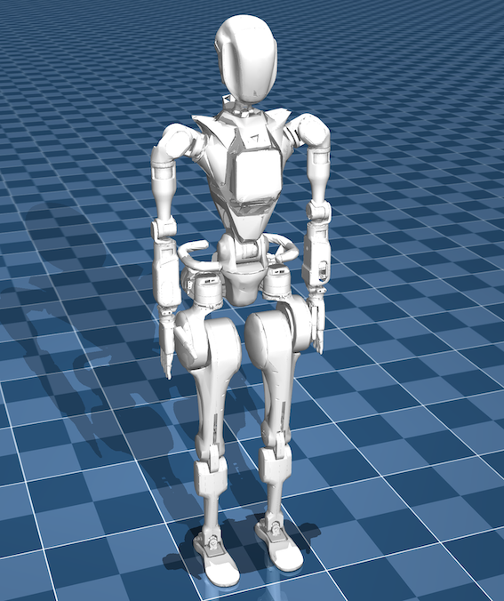

# Wiki-GRx-Mujoco



## Description
This repository provides an environment used to test the RL policy trained in NVIDIA's Isaac Gym on the GRx robot model in Mujoco.

## User Guide
1. Create a conda environment:
   
   Create conda environment:
   ```
   conda create -n wiki-grx-mujoco python==3.8
   ```
   Activate the created environment:
   ```
   conda activate wiki-grx-mujoco
   ```

2. Install Mujoco and Mujoco-viewer:

    ```
    pip install mujoco mujoco-python-viewer
    ```
    - <https://mujoco.org/>
    - <https://github.com/google-deepmind/mujoco/releases>
  
3. Install more dependencies:
    ```
    cd wiki-grx-mujoco
    ```

    ```
    pip install -e .
    ```

4. Load the models in Mujoco:
   
   get into the file location:
   ```
   ./mujoco-3.1.5/bin/
   ```
   and run:
   ```
   ./simulate
   ```
   and drag the `.xml` file that you want to view in robots folder

5. Load trained policies in Mujoco:
   
   1. get into the file location
        ```
        ./run/scripts
        ```
   2. run the code and add argument
        ```
        Args1:
            robotid
        Args2:
            --load_model(policy)
        ```
        ``exmple:``

        load stand policy to control the robot GR1T1 to stand:
        ```
        ./mjsim.py gr1t1 --load_model /home/username/.../policy/stand_model_jit.pt
        ```
        or load the walk policy to control the robot GR1T2 to walk:
        ```
        ./mjsim.py gr1t2 --load_model /home/username/.../policy/walk_model_jit.pt
        ```
    You can modify the model parameters in `gr1tx_lower_limb.xml` and `robot_config`.


Thank you for your interest in the Fourier Intelligence GRx Robot Repositories.
We hope you find this resource helpful in your robotics projects!
